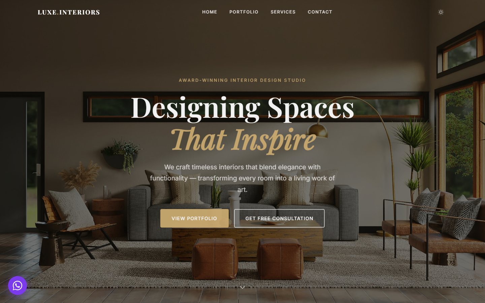

# Luxe Interiors

A fully static **Thai luxury interior design** website for Kuala Lumpur. Built without a build step — three files, deployed on GitHub Pages and ready to customise. Features a **saffron-gold Thai palette**, dark mode, portfolio filter, testimonial carousel, and a FormSubmit contact form.

## Live Demo

https://angchongboon.github.io/fluffy-octo-motor/

## Tech Stack

- **HTML5**: Semantic markup, OG meta tags, accessibility attributes
- **CSS3**: Custom properties for theming, dark-mode overrides, responsive grid and flex layouts
- **Vanilla JS**: Ten self-contained IIFEs — no framework, no bundler, no dependencies
- **GitHub Actions**: Automated deploy-to-Pages on every push to `main`

## Features

**Dark Mode**
- Toggles `dark` class on `<html>`, persisted via `localStorage`

**Portfolio Filter**
- `data-category` / `data-filter` attributes drive show/hide with `.hidden` and `.filtering` classes

**Testimonial Carousel**
- Responsive: 1 card on mobile, 2 on tablet, 3 on desktop
- Auto-advances every 5 s, pauses on hover, supports touch swipe

**Contact Form**
- Submits via `fetch` POST to FormSubmit (no backend required)

**Scroll Animations**
- `.fade-in` elements revealed by `IntersectionObserver` at 0.12 threshold
- Stats counter triggered at 0.4 threshold

## Deployment

**Local**: Open `index.html` directly in a browser — no server needed.

**GitHub Pages**: Push to `main`. The workflow at `.github/workflows/deploy.yml` uploads the repo root as a Pages artifact and deploys automatically.

## License

MIT
